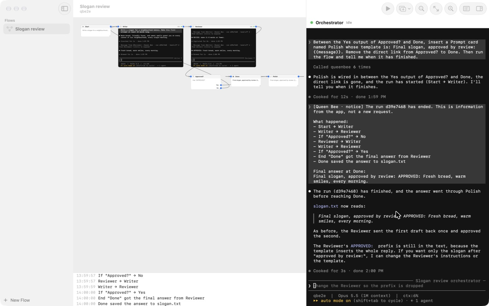

# Queen Bee

A Mac app for building and running flows of Claude Code agents on a canvas.

Each agent is a live `claude` session in a terminal that sits on the canvas. You can click into any of them and type. Logic cards (If / Else, Switch, And, Or, Prompt, Loop until, End) route each agent's finished reply to the next cards. Every flow also has an orchestrator, a Claude Code session docked beside the canvas that can edit the flow, run it and talk to the agents.



## Requirements

- macOS 26 or later, Apple silicon
- Xcode 27 and [xcodegen](https://github.com/yonaskolb/XcodeGen) (`brew install xcodegen`)
- [Claude Code](https://claude.com/claude-code) 2.1.287 or later, signed in. The app loads a small plugin into each session, which needs that version.

## Build and run

```sh
./scripts/build.sh
open build/Build/Products/Debug/QueenBee.app
```

Open a project folder when the app asks. Flows are saved in `<project>/.queenbee/flows/`, and agents work in the project folder.

## Use

- **New Flow** in the sidebar starts a flow with a Start card.
- **Add Card** in the toolbar adds an agent or a logic card. Each agent card starts its own Claude Code session.
- Drag a card by its title bar. Drag its bottom-right corner to resize it. Pinch to zoom and two-finger scroll to pan.
- Drag from a dot on a card's right edge onto another card to link them. Click a link to change its max passes or delete it.
- Click a card's title to edit its settings. Click inside a terminal to type in it; click empty canvas to give the keyboard back.
- Write the Start card's command, then press **Run**. The log under the canvas shows each hand-off.
- Or ask the orchestrator: "add a reviewer after the writer that loops until it approves, then run it".

## How it works

- `Core/` is a Swift package with no UI: the flow model, the file store, the routing engine, the orchestrator's tools and the socket messages. `cd Core && swift test` runs its tests.
- `App/` is the SwiftUI and AppKit app. The canvas is an `NSScrollView` with magnification, and each terminal is a SwiftTerm view inside a card.
- `Helper/` builds `qb`, a small binary inside the app bundle. Claude Code hooks, the plugin and the orchestrator's tool server all run it, and it talks to the app over a unix socket in `~/Library/Application Support/QueenBee/`.
- `Plugin/qb-link/` is the plugin the app loads into every session. When an agent's turn ends it asks the app where the reply goes and sends it there as a Claude Code session message.

The design is in `docs/superpowers/specs/2026-10-09-queen-bee-design.md`.

## Launch flags

- `--open <folder>` opens that project folder in the first window.
- `--float` keeps the window above others without taking focus. Terminals stop painting in a hidden window, so automated checks need it.
