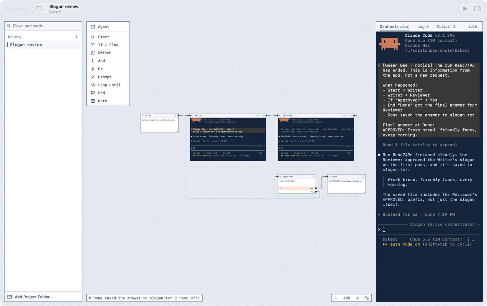

# Queen Bee

A Mac app for building and running flows of Claude Code agents on a canvas.

Each agent is a live `claude` session in a terminal that sits on the canvas. You can click into any of them and type. Logic cards (If / Else, Switch, And, Or, Prompt, Loop until, Approval, Script, Flow, End) route each agent's finished reply to the next cards. Every flow also has an orchestrator, a Claude Code session docked beside the canvas that can edit the flow, run it and talk to the agents.



The app follows light and dark. [The same run in dark](docs/queen-bee-flight-plan-dark.jpg).

## Install

**From a terminal** (opens straight away):

```sh
curl -fsSL https://raw.githubusercontent.com/bamboozledkitty/queen-bee/main/scripts/install.sh | sh
```

This downloads the latest release, checks it is signed by the Queen Bee developer's certificate and puts it in Applications. You can [read the script](scripts/install.sh) first.

**From the disk image:**

1. Download `QueenBee-<version>.dmg` from the [latest release](https://github.com/bamboozledkitty/queen-bee/releases/latest).
2. Open it and drag **QueenBee** onto the Applications folder beside it.
3. Open Queen Bee from Applications. macOS will say it could not verify the app; the steps below get past that.

You need:

- macOS 26 or later on Apple silicon.
- [Claude Code](https://claude.com/claude-code) 2.1.287 or later, signed in. The app loads a small plugin into each session, which needs that version.

Releases are signed with a Developer ID but not yet notarized by Apple. A copy downloaded in a browser is blocked the first time you open it, with a message that Apple could not verify it. The terminal install doesn't hit this. To open a blocked copy:

1. Click **Done** on that message.
2. Open **System Settings → Privacy & Security** and scroll to the Security section.
3. Click **Open Anyway** beside the line about Queen Bee, then confirm.

You only do this once. The app checks for updates by itself, and **Queen Bee → Check for Updates…** checks straight away. What changed in each version is in [CHANGELOG.md](CHANGELOG.md).

Queen Bee starts Claude Code sessions as you and is not sandboxed. Read [SECURITY.md](SECURITY.md) before opening flows from someone else.

Flows are saved in `<project>/.queenbee/flows/`, and agents work in the project folder.

## Build from source

You need Xcode 27 and [xcodegen](https://github.com/yonaskolb/XcodeGen) (`brew install xcodegen`).

```sh
./scripts/build.sh
open build/Build/Products/Debug/QueenBee.app
```

## Use

- **Add Project Folder…** at the foot of the sidebar adds a folder. Each folder lists its flows, and **+** beside its name makes a new one.
- The first time you open the app, a short walk-through explains agents, logic cards and the orchestrator. **Help → Welcome to Queen Bee** shows it again.

  

- An empty flow shows a note pointing at the orchestrator: describe the flow you want there and it builds it. Close the note to build by hand.
- The **palette** at the canvas's top-left holds the card types. Click one to add it, or drag it to where you want it. Rest the pointer on one to read what it does. Each agent card starts its own Claude Code session.
- An **Approval** card stops a run until you approve, edit or reject the message. A **Script** card runs a shell command and goes out Pass or Fail; a command you didn't type yourself asks before it first runs. A **Flow** card runs another flow of the project as one step.
- A Start card's settings can make it run on a schedule or when a file changes. Schedules run only while Queen Bee is open.
- **Run from here…** in a card's settings starts a run at that card with a message you give it. A card a run stopped at offers **Retry**.
- An agent's settings can be saved as a **role**, which then sits under Agent in the palette for any flow.
- Select several cards and choose **Group** (⌘G) to frame them under a name. Double-click the name to fold the group into one card. **Tidy Up** (⇧⌘L) lays the whole flow out left to right. **Find** (⌘F) goes to a card or flow by name. A map in the corner shows the whole flow once it has five cards or more.
- Drag a card by its title bar. Drag its bottom-right corner to resize it. A dragged card lines up with its neighbours or settles on the grid; hold Option to place it freely. Pinch to zoom and two-finger scroll to pan, or use the zoom control at the bottom-right.
- Shift-click cards, or drag a box on empty canvas, to select several. They move, duplicate (⌘D), copy, paste and delete together, and the arrow keys nudge them. Escape deselects.
- ⌘Z undoes the last change to the flow, including changes the orchestrator made. With the cursor in a text box, it undoes typing there first.
- Right-click a card, a link or empty canvas for a menu.
- Zoomed out below 40%, each card shows its name and state in large type in place of its contents.
- Drag from a dot on a card's right edge onto another card to link them. Click a link to change its max passes or delete it.
- Click a card's title to open its settings: rename it in the header, change its rows, and delete or restart it from the footer. Click inside a terminal to type in it; click empty canvas to give the keyboard back.
- Write the Start card's command, then press **Run**. Cards the run passes through get a check and a count, travelled links turn green, and the link a message is on now shows orange dashes.
- The panel on the right has the **Orchestrator**, the run **Log**, and the **Output** of each End card. The line at the canvas's bottom-left shows the latest step. Every run is kept between launches, and the Log tab's menu puts an earlier run back on the canvas.
- Click a link to read the messages it carried in the run on show.
- The figure beside the zoom control is what the flow has used, at API prices, as Claude Code reports it. Click it for a breakdown by agent and by run.
- When the app is in the background, a notification tells you that a card needs you or a run has ended. **Settings** turns this off.
- A flow that needs you says so on its sidebar row, and the toolbar shows a button that takes you to the waiting card.
- **View → Appearance** switches between light, dark and following the system.

## How it works

- `Core/` is a Swift package with no UI: the flow model, the file store, the routing engine, the orchestrator's tools and the socket messages. `cd Core && swift test` runs its tests.
- `App/` is the SwiftUI and AppKit app. The canvas is an `NSScrollView` with magnification, and each terminal is a SwiftTerm view inside a card. `App/Design/Tokens.swift` holds every colour, type size, spacing step and timing the views use.
- `Helper/` builds `qb`, a small binary inside the app bundle. Claude Code hooks, the plugin and the orchestrator's tool server all run it, and it talks to the app over a unix socket in `~/Library/Application Support/QueenBee/`.
- `Plugin/qb-link/` is the plugin the app loads into every session. When an agent's turn ends it asks the app where the reply goes and sends it there as a Claude Code session message.

## Tests

```sh
cd Core && swift test        # 162 unit tests on the model, store, engine, link router, snapping, layout, triggers and tools
./scripts/e2e.py             # end-to-end: real Claude Code sessions on Haiku, about five minutes
```

The end-to-end script starts a separate test copy of the app with its own support folder, so a copy you have open is left alone. It builds a scratch project with one flow per scenario and drives the app through a test harness that only exists when the app is launched with `--testing`. Name scenarios to run a few: `./scripts/e2e.py guard loop`.

## Launch flags

- `--open <folder>` opens that project folder in the first window.
- `--float` keeps the window above others without taking focus. Terminals stop painting in a hidden window, so a check that looks at the window needs it.
- `--welcome` shows the first-run walk-through in a test copy, which otherwise skips it.
- `--testing` turns on the test harness and lets a second copy of the app run. `QB_SUPPORT_DIR` in the environment moves that copy's socket and plugin.

`--testing`, `--welcome` and `QB_SUPPORT_DIR` only work in a debug build.

## Releasing

For maintainers. Raise `MARKETING_VERSION` and `CURRENT_PROJECT_VERSION` in `project.yml`, add a section for the version to `CHANGELOG.md`, then:

```sh
./scripts/release.sh            # build, sign, notarize and write appcast.xml, into dist/
./scripts/release.sh publish    # the same, then tag, push and create the GitHub release
```

The script's header lists the certificate, notarization profile and update key it needs.

## License

[MIT](LICENSE)
